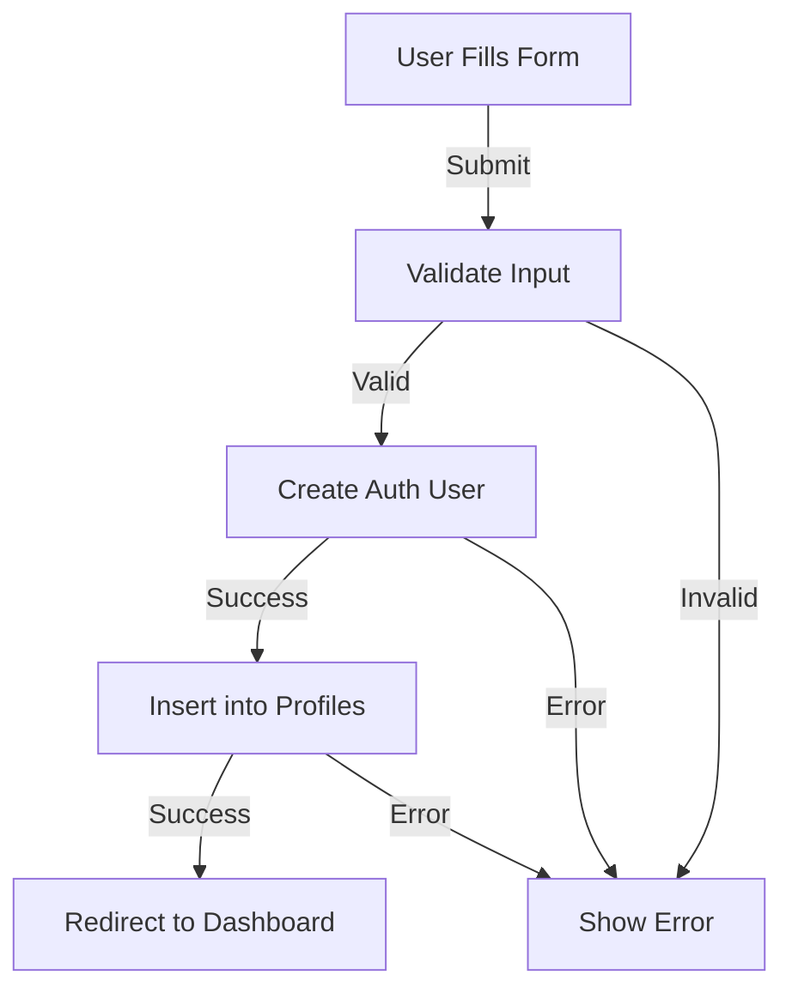
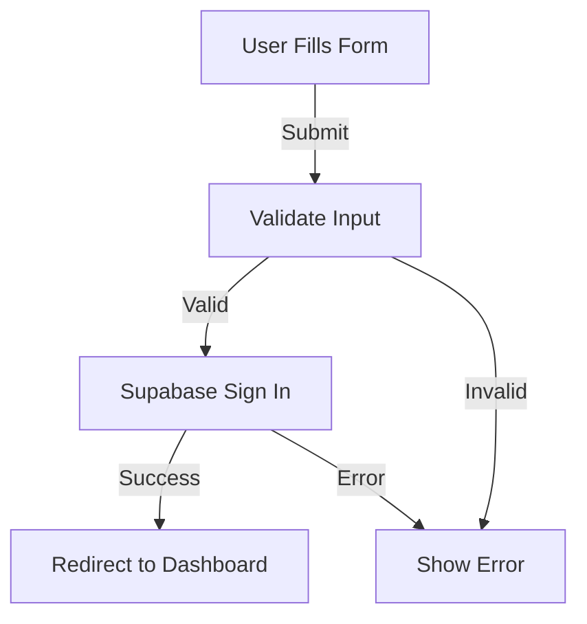

# Authentication Flow Configuration Guide

## Database Configuration

### Existing Profiles Table
The `profiles` table is already configured in Supabase with the following structure:
```sql
Table: public.profiles
Columns:
- id: uuid (PK, references auth.users)
- first_name: text
- last_name: text
- email: text
- created_at: timestamp with timezone
- updated_at: timestamp with timezone
```

### Required RLS Policies
Check and update RLS policies for the existing profiles table:
```sql
-- First, ensure RLS is enabled
alter table profiles enable row level security;

-- Update or create necessary policies
create policy "Users can read own profile" on profiles
  for select using (auth.uid() = id);

create policy "Users can update own profile" on profiles
  for update using (auth.uid() = id);

create policy "Users can insert their own profile" on profiles
  for insert with check (auth.uid() = id);
```

## Authentication Implementation

### 1. User Registration Flow


### 2. Login Flow


## Implementation Guide

### 1. Authentication Utility Functions
```typescript
// lib/supabase/auth.ts

import { createClientComponentClient } from '@supabase/auth-helpers-nextjs';

const supabase = createClientComponentClient();

interface SignUpData {
  first_name: string;
  last_name: string;
  email: string;
  password: string;
}

export async function signUpUser(data: SignUpData) {
  try {
    // 1. Create auth user
    const { data: authData, error: signUpError } = await supabase.auth.signUp({
      email: data.email,
      password: data.password,
    });

    if (signUpError) throw signUpError;

    if (authData.user) {
      // 2. Insert into existing profiles table
      const { error: profileError } = await supabase
        .from('profiles')
        .insert({
          id: authData.user.id,
          first_name: data.first_name,
          last_name: data.last_name,
          email: data.email,
        });

      if (profileError) throw profileError;
    }

    return { success: true, error: null };
  } catch (error) {
    return { success: false, error: error.message };
  }
}

export async function signInUser(email: string, password: string) {
  try {
    const { data, error } = await supabase.auth.signInWithPassword({
      email,
      password,
    });

    if (error) throw error;
    return { success: true, data, error: null };
  } catch (error) {
    return { success: false, data: null, error: error.message };
  }
}
```

### 2. Form Validation Rules
```typescript
interface ValidationRules {
  firstName: {
    required: true,
    minLength: 2,
  },
  lastName: {
    required: true,
    minLength: 2,
  },
  email: {
    required: true,
    pattern: /^[A-Z0-9._%+-]+@[A-Z0-9.-]+\.[A-Z]{2,}$/i,
  },
  password: {
    required: true,
    minLength: 6,
  },
}
```

### 3. Error Handling
```typescript
// types/auth.ts
export type AuthError = {
  code: string;
  message: string;
};

export const AUTH_ERROR_MESSAGES = {
  'auth/invalid-email': 'Invalid email address',
  'auth/email-already-in-use': 'Email already registered',
  'auth/weak-password': 'Password should be at least 6 characters',
  'auth/user-not-found': 'User not found',
  'auth/wrong-password': 'Invalid password',
};
```

## Integration with Existing Codebase

### 1. Required Environment Variables
```
NEXT_PUBLIC_SUPABASE_URL=your_project_url
NEXT_PUBLIC_SUPABASE_ANON_KEY=your_anon_key
```

### 2. Middleware Configuration
```typescript
// middleware.ts
import { createMiddlewareClient } from '@supabase/auth-helpers-nextjs';
import { NextResponse } from 'next/server';

export async function middleware(req) {
  const res = NextResponse.next();
  const supabase = createMiddlewareClient({ req, res });
  await supabase.auth.getSession();
  return res;
}

export const config = {
  matcher: ['/dashboard/:path*', '/auth/:path*'],
};
```

### 3. Protected Routes Configuration
```typescript
// app/dashboard/layout.tsx
import { createServerComponentClient } from '@supabase/auth-helpers-nextjs';
import { redirect } from 'next/navigation';

export default async function DashboardLayout({
  children,
}: {
  children: React.ReactNode;
}) {
  const supabase = createServerComponentClient({ cookies });
  const { data: { session } } = await supabase.auth.getSession();

  if (!session) {
    redirect('/auth/login');
  }

  return <>{children}</>;
}
```

## Testing Requirements

1. **Unit Tests**
   - Form validation
   - Auth utility functions
   - Error handling

2. **Integration Tests**
   - Sign up flow
   - Login flow
   - Profile creation

3. **E2E Tests**
   - Complete registration flow
   - Login and redirect
   - Error scenarios

## Implementation Steps for Bolt

1. Update auth utility functions to work with existing profiles table
2. Implement form components with proper validation
3. Set up error handling and loading states
4. Configure protected routes
5. Implement session management
6. Add proper error messages and UI feedback
7. Test all flows thoroughly

Note: All database operations should be done keeping in mind that the profiles table already exists. No table creation is needed, only proper interaction with the existing structure.